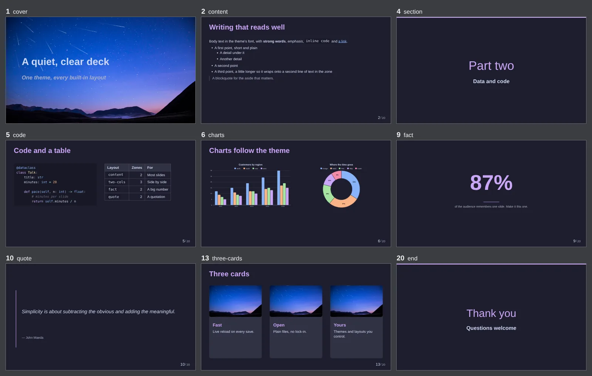
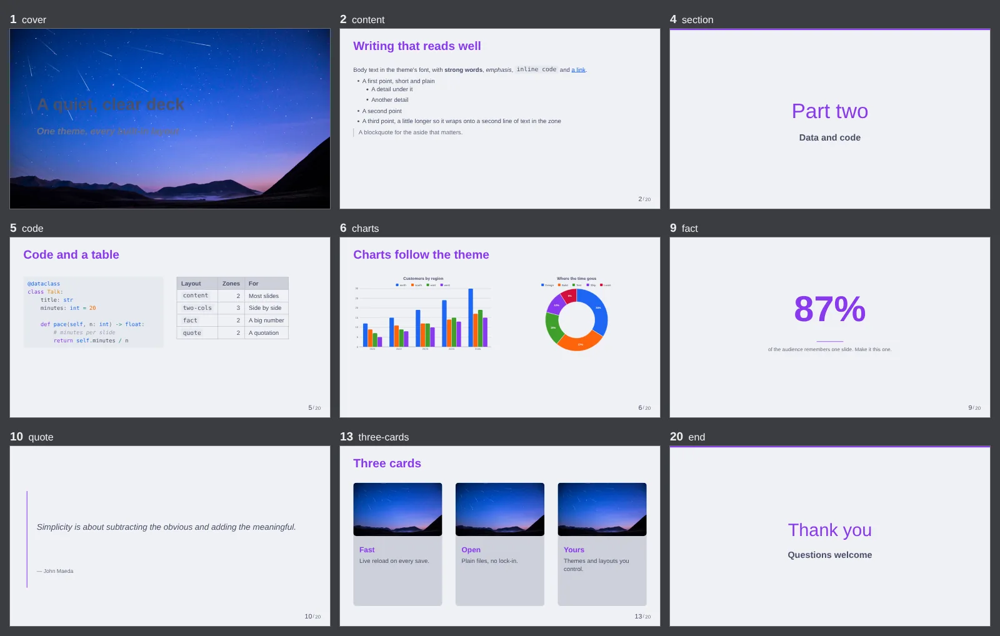
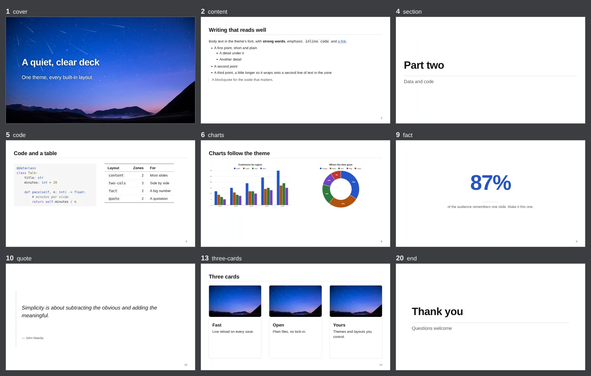
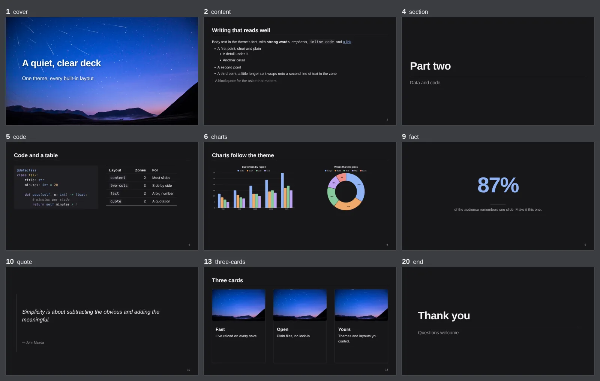
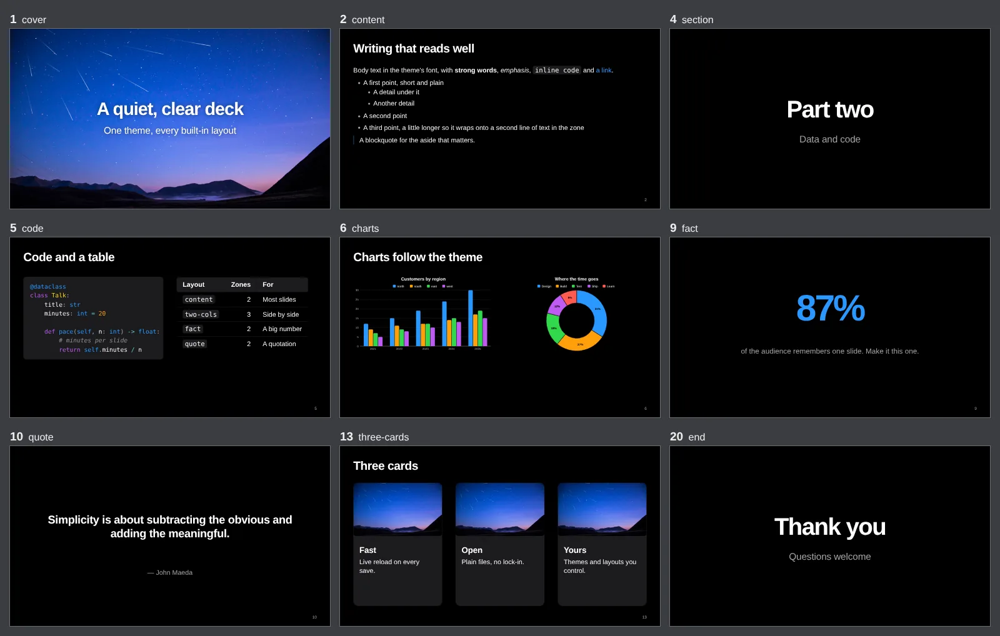
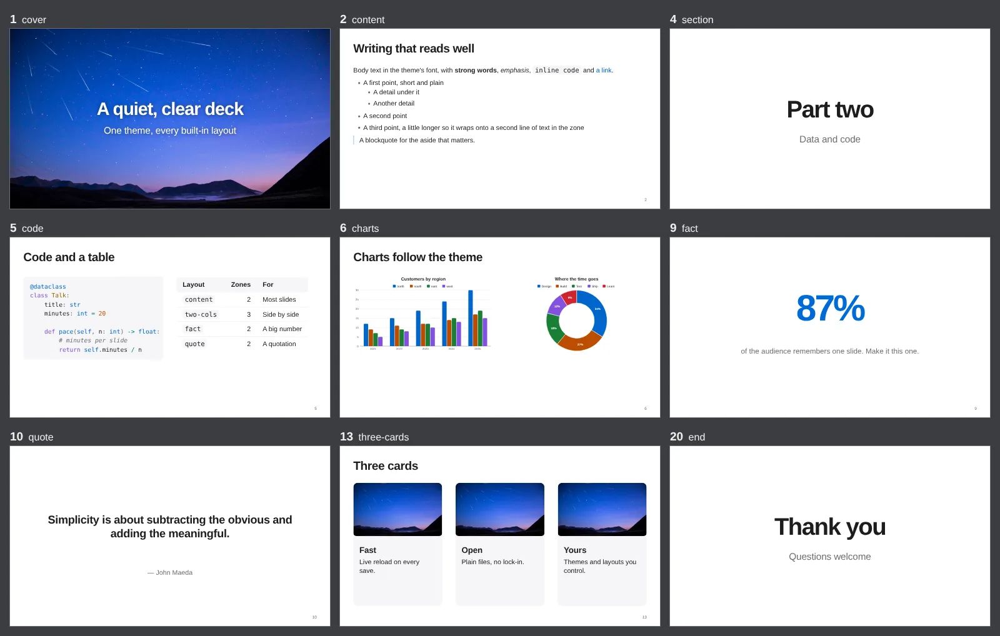

# Built-in themes

Inkflow ships three themes, so a deck looks finished before you touch any styling.
All three draw every [built-in layout](../design/layouts.md#built-in-layouts), set
the same fonts, and come in a dark and a light mode; they differ in colour, weight,
spacing and the small details of each layout.

| Theme | In `deck.py` | Opens in | The look |
|---|---|---|---|
| **Inkflow** (default) | `Deck()` | dark | [Catppuccin](https://catppuccin.com/) Mocha / Latte: soft pastels, a lilac accent |
| **Paper** | `Deck(theme=Paper())` | light | A well-set document: white, near-black text, hairline rules, one ink-blue accent |
| **Stage** | `Deck(theme=Stage())` | dark | The big-type keynote look: heavy tight headings, centred titles, soft cards, one vivid blue |

## Choosing one

In `deck.py`, import the theme and pass it to the deck:

```python
from inkflow import Deck, Paper, Slide


def main() -> Deck:
    return Deck(
        theme=Paper(),
        slides=[
            Slide("cover", md="title"),
            Slide("content", md="intro"),
        ],
    )
```

Or start a new deck on it:

```bash
inkflow init my-talk --theme paper      # or stage; default is the default
inkflow init my-poster --poster --theme stage
```

In the [visual editor](../editor/index.md), **deck ▾ → New deck…** offers Paper and
Stage as looks, and the **Theme** dialog has a *Theme* menu that switches the open
deck between the three (it rewrites `Deck(theme=...)` in `deck.py`, one undoable
step).

Every theme has both colour modes: `Deck(mode=ColorMode.LIGHT)` (or the Theme
dialog, or the presenter's light/dark switch) picks the other one. A printed deck
(a poster, `Deck(size="a0")`) is white paper unless you ask for dark, Stage
included.

## Inkflow (default)

The theme a deck gets when it names none, on the
[Catppuccin](https://catppuccin.com/) palette (Mocha in dark mode, Latte in light).

=== "Dark"

    

=== "Light"

    

The showcase deck walks through every layout on it; toggle light and dark mode in
the presenter to see both palettes.

[Launch showcase](./presentation/index.html){ .md-button .md-button--primary target="_blank" }

## Paper

A quiet white theme, set like a good document: near-black text on white, neutral
greys, one restrained ink-blue accent. Slide titles sit on a hairline, sections
open like chapters, tables are ruled above and below with no grid, cards are
paper with a hairline edge, slide numbers are small and grey. Its dark mode is
near-black rather than pure black, with the same calm.

=== "Light"

    

=== "Dark"

    

## Stage

The big-type keynote look: heavy headings with tight letter-spacing, lots of
space, centred cover, section, quote and end slides, soft grey cards with large
radii, and one vivid blue. Black on screen (a stage), with a white mode; its
body text is a little larger (40 px on a 1080-high slide, against 36).

=== "Dark"

    

=== "Light"

    

## Colours and contrast

Each palette sets every token deliberately, and the test suite checks them: text,
muted text, links, headings and the accent reach at least 4.5:1 against the
background and the card surface, the text on accent colour reaches 4.5:1 on the
accent and on every chart colour (pie and stacked-bar labels), and the eight named
colours read at 4.5:1 as code on the code background. Neighbouring chart series
are far apart in hue and lightness.

| Token | Paper light | Paper dark | Stage dark | Stage light |
|---|---|---|---|---|
| `bg` | `#ffffff` | `#17171a` | `#000000` | `#ffffff` |
| `surface` | `#f4f4f5` | `#222226` | `#1c1c1e` | `#f5f5f7` |
| `text` | `#1c1c1f` | `#e4e4e8` | `#f5f5f7` | `#1d1d1f` |
| `text_muted` | `#5c5c63` | `#a2a2aa` | `#a1a1a6` | `#6e6e73` |
| `accent` | `#2453c7` | `#8fb2f5` | `#2997ff` | `#006ad8` |
| `link` | `#2453c7` | `#8fb2f5` | `#2997ff` | `#0066cc` |

The full palettes are in the [Themes reference](../reference/theme.md#built-in-themes).

## Customising a built-in theme

Change a few tokens on top of a theme by subclassing it; the subclass keeps the
theme's stylesheet and fonts:

```python
from dataclasses import replace

from inkflow import Deck, Paper


class Ours(Paper):
    light = replace(Paper.light, accent="#b4321f", link="#b4321f")
    dark = replace(Paper.dark, accent="#f08c84", link="#f08c84")


def main() -> Deck:
    return Deck(theme=Ours(), slides=[...])
```

Or leave `deck.py` alone and override tokens in the project's `styles.css`, which
loads after the theme (the editor's Theme dialog writes exactly this):

```css
:root { --inkflow-accent: #f08c84; }
:root[data-theme="light"] { --inkflow-accent: #b4321f; }
```

[Themes](../design/themes.md) covers the token API, writing a theme of your own and
restyling a layout.

## Using a built-in layout

Pass the bare layout name to `Slide`, with Markdown or SVG content:

```python
from inkflow import Deck, Slide


def main() -> Deck:
    return Deck(
        slides=[
            Slide("cover", md="title"),
            Slide("two-cols", md="compare"),
            Slide("end", md="thanks"),
        ]
    )
```

The themes ship eighteen layouts plus two building blocks,
listed with their zones in [Layouts](../design/layouts.md#built-in-layouts).
[Markdown zone markers](../authoring/markdown.md#explicit-markers)
such as `::left::` and `::quote::` target the named zones in each layout.

<!-- The screenshots are themes-tour/deck.py, slides 1 2 4 5 6 9 10 13 20:
     INKFLOW_TOUR_THEME=paper INKFLOW_TOUR_MODE=light inkflow render
       --deck themes-tour/deck.py --sheet -s 1 -s 2 ... --scale 0.25 -o paper-light.png
     then converted to WebP. -->
