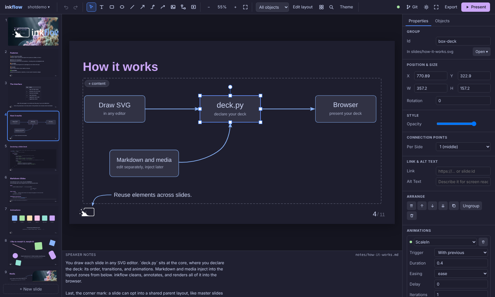

# Visual editor

`inkflow edit` opens a slide editor in the browser: a slide list on the left, the
slide in the middle, its properties on the right and the speaker notes below.
You click, drag and type on the real slide, the same rendering the presenter shows,
and every change is written straight back into the deck's own files.

```bash
inkflow edit            # opens http://localhost:7777/edit
```



It is the same server as `inkflow serve`: the presenter stays at `/`, and
<kbd>e</kbd> in the terminal opens the editor again. There is no separate project
format and nothing to import. The editor, Inkscape, your text editor and an
agent such as [Claude Code](claude-code.md) can all work on a deck at the same time;
the file watcher shows each one the others' changes within a moment.

## Where an edit goes

| You change… | …and the editor writes |
|---|---|
| A shape, text, image, its position, size, rotation, colour | The slide's SVG, in place: only the attributes you touched |
| Text in a zone | That zone's section of the slide's `.md` file, created on the slide's first text (see below) |
| Text in a zone filled by a `TextBox(...)` | Its `text=` in `deck.py` (its settings are Python) |
| Slide order, new / duplicate / hidden / deleted slides | The `Deck(slides=[...])` list in `deck.py` |
| Transition, animations, title, font size | That slide's `Slide(...)` call in `deck.py` |
| Speaker notes | The slide's notes file (created on first edit if it has none) |
| An inserted image | Copied into `assets/`, referenced relative to the SVG |
| An inserted video | Copied into `assets/`; a `zone-video` rect in the slide's SVG plus `zones={"video": Video(...)}` in `deck.py`, as one undo step |
| An image or video zone's settings | Its `Image(...)` / `Video(...)` call in `deck.py` |
| A new text box | A `zone-text` rect in the slide's SVG; its Markdown in the slide's `.md` file |
| A crop | The picture's SVG: the `<image>` goes into a nested `<svg>` frame |
| A draw.io diagram | `diagrams/<name>.drawio.svg` (draw.io's editable SVG, its source stored uncompressed), shown on the slide as an `<image>` |
| Ink drawn with the pen | `ink/<slide id>.svg`, one `<path>` per stroke (see [Ink](#ink)) |
| A line or arrow attached to shapes | A `<path>` with `inkflow:connector` and `inkflow:connect-start` / `-end`; re-routed in the same edit whenever an attached shape moves |
| An elbow's moved middle segment, a shape's extra connection points | `inkflow:bend` on the arrow, `inkflow:sites` on the shape |
| A link, alt text, hiding, locking | The object in the SVG: an `<a href>` around it, a `<title>`, `display:none`, `inkflow:locked` |
| Theme colours and fonts | One marked block in the project's `styles.css` |
| Colour mode, base font size | `Deck(mode=..., font_size=...)` in `deck.py` |

**Slide text lives in Markdown files.** The first time you type into a slide that
has no `.md` file (a new slide from the gallery, say), the editor creates
`slides/<slide-id>.md`, points the slide at it with `md=`, and writes the text
there. Plain text already in that slide's `zones={...}` moves into the file in the
same undo step, so `deck.py` keeps the deck's structure and the words live in
Markdown. The file is named after the slide's id, so `slide:<id>` links keep
working. For older slides, **Move text to Markdown** under *Files* in the slide
panel does the same on demand (it also turns `md=Inline(...)` into a file).
A `TextBox(...)` stays in `deck.py`, since its alignment and padding are Python
settings.

`deck.py` is edited structurally: comments and formatting are kept, and a comment
written above a slide moves with it. If your slide list is built in code (a loop, a
helper function), the editor shows those slides but leaves slide-level settings to
you, read-only.

Every edit is one undo step (<kbd>Ctrl</kbd>+<kbd>Z</kbd>). A burst of typing is
one step, not one per keystroke. Undo restores the exact bytes it replaced, and it
refuses rather than overwrite a file that was changed outside the editor since.
The Undo and Redo buttons name the step they would take back.

Slide-list changes an agent makes with
[`inkflow slide`](claude-code.md#changing-the-slide-list), and the shapes,
text boxes and arrows it draws with
[`inkflow shape`](claude-code.md#shapes-and-arrows), while the editor is
open go through the editor too: each is an ordinary undo step, labelled
*Agent: …*, announced at the bottom of the window with an **Undo** button (it
takes back that change while nothing else came after it; then use
<kbd>Ctrl</kbd>+<kbd>Z</kbd>).

## New decks, and switching between them

The **deck ▾** button next to the logo names the open deck and manages decks:

- **New deck…** asks for a title, a look (each drawn as a small slide in its
  colours) and a folder:
    - *This deck's look* keeps the open deck's `deck.py` (theme, overlays, colour
      mode, transitions, its own animation classes) with three starter slides in
      place of its slides, and copies its `styles.css`, `scripts.js`, `layouts/`,
      `overlays/` and `fonts/`, with the files those refer to;
    - *Inkflow default* is what `inkflow init` makes: the built-in theme and three
      starter slides;
    - *Paper* and *Stage* are the same starter slides on the other two
      [built-in themes](../built-in-theme/index.md) (`inkflow init --theme`);
    - *Inkflow example* is the same in the look of inkflow's demo deck (the logo
      footer overlay);
    - *Layout showcase* has one slide for each built-in layout, to start from;
    - *Poster* is a conference poster (`inkflow init --poster`): one page on a
      built-in poster layout with example sections, a chart and a figure, at the
      **Paper size** picked below it (A0 to A2, portrait or landscape). See
      [Posters and page sizes](../authoring/posters.md).

    When the open deck is in a git repository, the new deck goes into a new folder
    next to it, in the same repository. Anywhere else, browse to any folder on
    your computer, and **Create a git repository for this deck** (on by default)
    gives it its own repository with a `.gitignore` and the SVG hooks of
    `inkflow setup-git`. The deck opens once it is made.
- **Open deck…** browses to any folder with a `deck.py` in it.

Both use the same folder picker:

- Type a path; <kbd>Tab</kbd> completes a folder name (as far as the folders
  starting with what you typed agree), <kbd>Enter</kbd> opens it.
- Typing narrows the list to the folders whose names start with what you typed,
  in the path line and in the list alike. <kbd>↓</kbd> / <kbd>↑</kbd> move
  through the list, <kbd>Enter</kbd> opens a folder, <kbd>Backspace</kbd> goes
  up, and <kbd>Esc</kbd> clears what you typed.
- **Browse…** opens your system's own folder chooser instead (zenity or kdialog
  on Linux, the Finder's on macOS, the Windows one). It shows on the computer
  running inkflow, possibly behind the browser.
- **☆** adds the folder to your favourites, shown as buttons above the list.
  **Make this the default location** is where new decks go and where Open deck
  starts. Unless the open deck's git repository says otherwise, a new deck then
  goes next to it in that repository. Both are saved for your user, so every
  editor offers them.
- **Recent decks** reopens one of the last ten.

Opening a deck switches the running server to it, on the same address: the
editor page reloads with the new deck, and the presenter at `/` shows it too.

### Starting without a deck

`inkflow edit` in a folder without a `deck.py` (or `inkflow edit --start`
anywhere) opens the editor on its start page instead: **New deck…**, **Open
deck…** and the recent decks, the same choices as the deck menu. A new deck goes
in your home folder unless you browse elsewhere. Pick one and the editor opens it.

To have inkflow in your application menu, install it as a tool and add a
launcher:

```bash
uv tool install inkflow     # the `inkflow` command, in its own environment
inkflow setup-desktop       # Inkflow in the application menu
```

The launcher starts the editor in your browser with no window of its own: the
server runs in the background and stops a minute after its last tab closes
(reloads and switching decks are fine), or at once with **Quit Inkflow** in the
deck menu or on the start page. Your edits are saved as you make them, so
nothing is lost either way. `inkflow setup-desktop --terminal` makes a launcher
that runs the server in a terminal window instead, which shows its status and
stops it when closed.

The launcher starts the installation that created it, so `uv tool upgrade
inkflow` keeps it working. On Linux it is a `.desktop` entry with an icon under
`~/.local/share`, on macOS `~/Applications/Inkflow.app`, on Windows a Start menu
shortcut. `inkflow setup-desktop --remove` takes it away again.

### One server per deck

Every launch (and every `inkflow edit` or `inkflow serve`) is a server of its
own, on the next free ports, so several decks can be open side by side, each in
its own tab or window. A deck is only ever open in one server, though, so two
editors never write the same files: opening a deck that another server already
has (from the start page, the deck menu or the command line) takes you to that
server's editor instead. Open more tabs or windows on the same address to work
on one deck in several places; they all stay in sync.

## Version control

When the deck is in a git repository, the toolbar's **git** button shows the
branch and how many files changed. Its menu covers what a deck needs day to day:

- **Commit…** lists the changed files (the deck's own ticked, others in the
  repository not) with a message ready to change, *Update slides (2026-10-09
  14:30)*; <kbd>Ctrl</kbd>+<kbd>Enter</kbd> commits. **Commit and push** does
  both when there is a remote. If git does not know who you are yet, the dialog
  asks for a name and email for this repository. When the deck depends on
  this computer in a way packing would fix (a font only your computer has, a
  file outside the deck, no `uv.lock`, no line-ending or Git LFS rules), the
  commit first asks: it lists what is missing in plain words, and **Pack and
  commit** (the default) packs the deck and puts the files packing wrote into
  the same commit; **Commit without packing (not recommended)** commits as it
  is and says what other machines will lack (another font for the slides, a
  picture missing from the repository…). When nothing is missing, the commit
  goes ahead with no question.
- **Pack deck…** makes the deck self-contained: fonts, outside files, lock
  file, git rules, so it looks the same on every machine. The dialog lists what
  packing will do and what will still depend on the machine; **Pack** does it
  as one step you can undo, then shows the files written. It copies files from
  your computer, so it works only from an editor on the computer running
  `inkflow edit`. See [A deck that looks the same everywhere](../presenting/portable.md).
- **Push** and **Pull** (fast-forward only). The first push of a new branch sets
  its upstream on `origin`.
- **Discard changes…** puts the ticked files back as they were in the last commit
  and deletes new ones. It cannot be undone, so the dialog lists every file.
- **⚠ media files not in Git LFS…** appears when videos, audio, images, fonts,
  documents or any file over 5 MB in the deck would be stored whole in git: no
  `.gitattributes` rule sends them to [Git LFS](https://git-lfs.com), or they were
  committed before one did. **Track with Git LFS** adds the rules to the deck's
  `.gitattributes` and stages the files again as LFS files (commit to keep it;
  earlier commits keep their copies). **Use git without LFS** records in
  `.gitattributes` that this deck stays git only, and the warning stops, for
  everyone.
- **Undo last commit** takes the last commit back while it has not been pushed;
  its changes stay as uncommitted edits.
- **Branches…** switches branch or creates one from where you are (uncommitted
  changes come along).
- **History…** lists the commits that changed this deck. **View** shows the deck
  as it was then (no branch; switch back under Branches), **Restore** makes the
  deck's files what they were then as changes you can commit, and **Revert**
  undoes one commit with a new commit. **Compare** shows the deck then and now
  side by side.
- **Worktrees** lists the deck's other git worktrees: a branch of the deck in a
  folder of its own, typically one a coding agent works in while you keep
  editing (see [Editing with Claude Code](claude-code.md#working-on-a-branch)).
  Each row shows its branch, how many commits it is ahead of and behind yours,
  and uncommitted changes; **Compare** shows its slides next to yours. Click a
  row for what to tell the agent, **Merge into** your branch (a fast-forward
  when it can, else a merge commit; refused while your deck has uncommitted
  changes; a conflict is aborted and its files named) and **Remove** (asks
  again before losing uncommitted changes or unmerged commits). **New
  worktree for an agent…** makes one: branch `deck/<name>` from your last
  commit, in `.inkflow/worktrees/<name>`.
- **Compare…** compares the working copy with a commit, a branch or worktree,
  or another deck folder, slide by slide: see
  [Comparing two versions](compare.md).
- **Publish…** puts the deck online at every push, on GitHub Pages or GitLab
  Pages (preselected from the `origin` remote), optionally with a release
  (one HTML file and a PDF) at every tag `v…`. The dialog lists the files it
  writes at the repository's root (and a README link, if you like), writes
  them as one step you can undo, offers to commit them, and shows the address
  the slides will have and the one setting to change on the host. Once set
  up, the menu shows **Published at …** (a link) and **Publish… (update)**
  writes the files again. It also names fonts only your computer has, which
  the online deck would miss. See [Publishing online](../presenting/publish.md).

Discard, pull, switching or creating a branch, merging a worktree, and View, Restore or Revert change
the deck's files on disk, so the editor's undo and redo history starts over after
them; the first of these in a session says so and asks before going ahead.

New decks and new repositories get a `.gitattributes` sending media through Git
LFS; untick **Store videos, images and fonts with Git LFS** in the New deck dialog
(or `inkflow init --no-lfs`) for a git-only deck.

Without a repository, the menu offers **Create a git repository** (or one
without LFS). Everything runs
the `git` on your computer, so your usual credentials and hooks apply; the editor
never waits for a password prompt (a push that needs one fails with git's
message). Files git changes are picked up like any other change, and the
editor's own undo history starts over after them. Pushing, pulling, creating a
repository, adding, merging or removing worktrees, and opening or creating decks
work only from an editor page on the computer running `inkflow edit`.

## Several decks, and copying between them

Run `inkflow edit` once per deck. Each instance takes the next free ports
(7777, then 7779, …), so the editors open side by side in your browser, like
two PowerPoint windows. The terminal says so when 7777 is taken, and prints the
address it serves on instead.

Slides copy between them through the system clipboard. Select slides in the
slide list (<kbd>Ctrl</kbd>+click adds one, <kbd>Shift</kbd>+click a range),
press <kbd>Ctrl</kbd>+<kbd>C</kbd> (or right-click → Copy), switch to the other
editor, pick the slide to paste after, and press <kbd>Ctrl</kbd>+<kbd>V</kbd>.
A copied slide takes everything it needs with it: its SVG, Markdown and notes,
the project's own layouts it is built on, and every image or video it shows.
In the receiving project:

- a file that is already there with the same contents is reused, so a shared
  layout or logo is not duplicated;
- anything else that would clash gets a new name (`intro-2.svg`), and every
  reference to it (in `deck.py`, in the SVGs that build on it, in Markdown
  image links) is rewritten to match;
- the pasted `Slide(...)` calls go into `Deck(slides=[...])` in one undoable
  step, with any `from inkflow import` names they need.

Pasting into the deck the slides came from makes independent copies.

Objects copy the same way: select shapes, <kbd>Ctrl</kbd>+<kbd>C</kbd>, and
<kbd>Ctrl</kbd>+<kbd>V</kbd> on a slide in either editor; images come along.

Two things cannot travel. Animation or transition types a deck defines in its
own `deck.py` are left out, and copying says which. Slide-specific overlays are
dropped too, since the receiving deck's own overlays apply. And because the
clipboard is shared with everything else on your computer, a paste only accepts
a plain `Slide(...)` built from inkflow's own types, never arbitrary Python.

## Sections

[Sections](../authoring/slides.md#sections) group the slide list under named
headers, each with its slide count and a caret that collapses it (collapsed
sections are remembered per deck in this browser, never written to `deck.py`;
the section holding the slide you edit opens by itself).

- **Add**: right-click a slide, **Add section here…**: the new section starts at
  that slide and takes the rest of its section.
- **Rename**: double-click the name (or **Rename…** in the header's menu);
  <kbd>Enter</kbd> keeps it, <kbd>Esc</kbd> cancels.
- **Move a section**: drag its header above or below another section (dropped on
  a slide, it goes before or after that slide's section), or **Move section
  up/down** in its menu. Slides before the first section stay first.
- **Move slides between sections**: drag them (the picked slides go together);
  dropped on a header they become the first slides of that section, so an empty
  or collapsed section takes slides too.
- The header's menu also has **Select all slides in section**, **Collapse all /
  Expand all**, **Remove section** (its slides join the section before it) and
  **Remove section and its slides…** (after a confirmation).

Each of these is one step in the undo history, like any edit of the slide list.

## The grid view

<kbd>G</kbd> (or the grid button in the toolbar) shows every slide as a large
thumbnail, like the presenter's overview, in one block per section. It works
like the slide list: click to pick (<kbd>Ctrl</kbd>/<kbd>Shift</kbd> for
several), drag to move the picked slides (into another section too),
right-click for the slide menu, <kbd>Ctrl</kbd>+<kbd>C</kbd> / <kbd>V</kbd> /
<kbd>Delete</kbd> on the picked slides. A section's heading selects all its
slides with a click, collapses with its caret, moves the whole section when
dragged and has the section menu on right-click. The arrow keys move around the
grid, across sections; double-click or <kbd>Enter</kbd> opens a slide,
<kbd>Esc</kbd> goes back. The size slider sets how large the thumbnails are.

## The canvas

- **Select** with a click; <kbd>Shift</kbd>+click adds to the selection; drag on
  an empty area to select everything inside a box. <kbd>Ctrl</kbd>+<kbd>A</kbd>
  selects all.
- **Move** by dragging or with the arrow keys (<kbd>Shift</kbd> moves 10 units).
  Smart guides snap to the slide's edges and centre and to other objects;
  hold <kbd>Alt</kbd> to drag freely, <kbd>Shift</kbd> to keep to one axis.
- **Copy by dragging**: hold <kbd>Ctrl</kbd> (<kbd>Cmd</kbd> on a Mac) while you
  drop, as in PowerPoint or draw.io. The originals stay where they are and the
  copies land where you let go; add <kbd>Shift</kbd> to keep them in line with
  the originals. Arrows copied together with the shapes they connect stay
  attached to the copies. Ctrl+click without dragging still adds to or takes
  from the selection.
- **Copy a style** from one object onto others, like a format painter:
  **Copy style** in the right-click menu (<kbd>Ctrl</kbd>+<kbd>Alt</kbd>+<kbd>C</kbd>),
  then select the others and **Paste style**
  (<kbd>Ctrl</kbd>+<kbd>Alt</kbd>+<kbd>V</kbd>). Shapes take the fill and stroke
  (theme colours stay theme colours), stroke width, dashes, opacity, shadow,
  arrow heads and a rectangle's rounded corners; texts take the colour and font
  settings; text boxes also their padding, alignment and drawn box. Pasting onto a
  group restyles every shape in it.
- **Resize** with the handles. Text, images and circles keep their proportions;
  <kbd>Shift</kbd> toggles that.
- **Rotate** with the round handle above the selection; <kbd>Shift</kbd> snaps to
  15°.
- **Reach an object under another** with a middle-click (or <kbd>Alt</kbd>+click):
  each click selects the next object under the pointer, topmost first.
- **Edit text** by double-clicking it. Text inside a group is edited directly.
- **Enter a group** by double-clicking it; <kbd>Esc</kbd> leaves it.
- **Zoom** by pinching on a trackpad or with <kbd>Ctrl</kbd>+scroll, toward
  the pointer (the point under it stays put), or with <kbd>+</kbd> /
  <kbd>−</kbd>; <kbd>0</kbd>, or a double-click on the slide's empty area or the
  grey around it, fits the slide to the window. Scrolling (two fingers on a
  trackpad) moves around a zoomed slide. <kbd>F</kbd> (or the toolbar's
  full-screen button) gives the editor the whole screen.
- **On a touchscreen**, one finger does what the mouse does: tap to select,
  drag to move, drag on the empty slide for a marquee, and draw with an insert
  tool. Two fingers pinch to zoom and pan at once, and a double tap on the empty
  area fits the slide. A finger's touch only takes effect once it has moved a
  little and a moment has passed, or once it lifts, so a pinch never selects or
  moves what the first finger landed on. With the pen tool a pen draws while
  your hand rests on the screen; with *Hand* on, one finger draws and two
  fingers still zoom (the stroke the first finger began is dropped).

The editor shows every object by default. To see what the audience sees at a given
click, pick a build step in the toolbar; editing pauses while you preview.

**Animations at a glance.** With nothing selected, the slide panel's
**Animation order** lists every animation of the slide with the click it plays
on, and each one's **type** and **trigger** (on click, with previous, after
previous) can be changed right there, without selecting the animated object
first; ↑ / ↓ reorder them. A new type keeps the settings both types share.
**▶ Play** plays the slide's animations on the canvas, click by click, the way
the presenter plays them (the playing click is highlighted in the list);
the ▶ on a row, or on an animation in an object's own panel, plays from that
animation's click. A click on the slide or <kbd>Esc</kbd> stops it, and the
editor goes back to showing every object.

## Text boxes and Markdown zones

Text in a layout's zones, and in text boxes, is Markdown: double-click it and you
edit the text right where it is on the slide, with a formatting bar above it:

- paragraph style (text, title, heading, subheading, quote);
- **bold**, *italic*, ~~strikethrough~~ and `code` for the selected words
  (<kbd>Ctrl</kbd>+<kbd>B</kbd>, <kbd>Ctrl</kbd>+<kbd>I</kbd> work too);
- a text colour from the theme's palette, so coloured words follow dark and light
  mode;
- links (<kbd>Ctrl</kbd>+<kbd>K</kbd>): a web address, or `slide:<id>` to jump to
  another slide;
- bulleted, numbered and checklists (<kbd>Tab</kbd> / <kbd>Shift</kbd>+<kbd>Tab</kbd>
  indent and outdent); tick a checklist item by clicking its box;
- **⏵ reveal on click**: what follows the caret appears one click later in the
  presentation (it writes a `::step::` marker);
- tables: insert one, then <kbd>Tab</kbd> moves from cell to cell (and adds a row
  at the end), and the bar gains buttons to add or delete rows and columns and to
  align a column;
- **∑ formulas**: type LaTeX into the field that opens and the formula renders live
  in the text; tick *Display* for a centred formula on its own line. A formula
  already in the text is a chip: click it to change the LaTeX, <kbd>Enter</kbd> to
  finish, <kbd>Esc</kbd> to put it back as it was. It is saved as `$…$` or
  `$$…$$`, so the presentation renders it exactly like Markdown math.

Click outside the text (or <kbd>Ctrl</kbd>+<kbd>Enter</kbd>) to finish; it is saved
as ordinary Markdown in the same file it came from, as one undo step;
<kbd>Esc</kbd> cancels. Pasting brings plain text only.

Some Markdown has no in-place form: code blocks, images, `::step::` reveals.
A zone that contains any of them opens its Markdown source in a pane under the
slide instead, where the slide re-renders as you type; the **M↓** button switches
to that pane at any time. Nothing is ever dropped: the editor only edits in place
when it can write back exactly what the zone holds.

Empty zones show a small **+ zone** label; click it to start writing in place: the
zone gets its name as text, selected, so typing replaces it. Leave it as it is, empty
it or press <kbd>Escape</kbd> and the zone is empty again. For zones named like
`media`, `image` or `video` the label picks an image or video instead.

## Drawing

The toolbar's rectangle and ellipse tools draw new shapes. Click to drop one at a
default size, or drag to size it. New shapes use the theme's colour
classes (`inkflow-fill-surface`, `inkflow-stroke-accent`, …), so they follow dark
and light mode like everything else. Images can be picked from the toolbar,
dropped onto the slide or pasted from the clipboard.

The **text** tool draws a text box: drag out its width (or click for a default
one) and start typing. The text wraps inside the box, takes every formatting
above, and the box grows to fit what you type. A text box you empty is deleted.
Under the hood it is a zone of its own (a `zone-text` rect), so its Markdown lives
with the slide's other text. Where there is nowhere to keep Markdown (a slide list
built in code, or while editing a layout), the tool places a plain SVG text line.

**Text in a shape.** Double-click a rectangle or ellipse (or select it and press
<kbd>Enter</kbd>) and type: the shape becomes a text box that keeps its fill,
stroke and rounded corners, with wrapping Markdown text inside it, formulas
included. Its text is centred horizontally and vertically, as labels in diagrams
usually are. The properties panel's **Text box** section sets the padding and the
horizontal and vertical alignment, and **Draw the box** gives any text box (the
plain ones too) a visible background and border, styled with the same fill and
stroke controls as a shape. In the SVG this is the zone shape keeping its own
style plus `inkflow:show-shape="true"`; without that attribute a zone's shape is
only a placeholder and is never painted.

Many slides are drawn directly by a shared layout (`Slide("content", md=...)`).
The first time you draw on one, the editor gives it its own SVG in `slides/`, built
on that same layout, and points the slide at it. Nothing changes visually, and the
layout itself is left alone.

## Ink

The **pen** tool (<kbd>P</kbd>) draws on the slide by hand, the way the
presenter's [ink mode](../presenting/ink.md) does, and the floating palette is
the same: pen, highlighter and eraser, the theme's colours plus black, white and
any colour, three widths, undo and clear. A pen's pressure shapes the line; a
mouse or a finger draws too unless you turn the hand button off, in which case
only a pen draws and the mouse keeps selecting.

Each stroke is saved as you lift the pen, into the slide's ink file
(`ink/<slide id>.svg`), never into the slide's own SVG, so ink on a slide that is
drawn by a shared layout stays on that slide alone. Every stroke is one undo
step; so is one sweep of the eraser, and **Clear** (which removes the file).
With the select tool, a stroke is an object like any other: click it to select
it, drag to move it, <kbd>Delete</kbd> to remove it.

Moving, duplicating, deleting or re-laying-out a slide takes its ink along (a
slide's ink file is named after its id, which those can change); see
[how ink is saved](../presenting/ink.md#how-ink-is-saved).

## Lines, arrows and connectors

Lines and arrows connect shapes, as in PowerPoint. The toolbar has four tools:
line (<kbd>L</kbd>), arrow (<kbd>A</kbd>), elbow arrow (<kbd>E</kbd>, right-angled
turns) and curved arrow (<kbd>C</kbd>). With any of them, hovering a shape shows
its connection points (the middle of each edge by default, turning with the
shape). Start or end the drag on one and that end attaches there. From then on
the arrow follows the shape: move, resize, rotate or nudge it and the arrow is
re-routed in the same undo step.

**More connection points.** A shape's **Connection points** section sets how many
points each side offers (1, 2, 3, 4, 5, 7 or 9), so a box can take, say, three
inputs on its left side. Hovering the section shows them on the slide. An arrow
attached to a point keeps it when you later choose fewer.

**Reshaping an elbow.** A selected elbow arrow has a yellow handle on its
adjustable segment: the middle one between two facing sides, or the last vertical
(or horizontal) run before it enters a top or side. Drag it to move that segment,
for example to route around another shape. The arrow keeps that shape when its
shapes move; **Reset bend** in the Connector section puts it back. Between two
sides facing the same way, the default elbow now goes around rather than through
the shapes.

Select an arrow to see its two ends as handles; a filled handle is attached. Drag
an end onto another shape's point to re-attach it, or into empty space to free it
(hold <kbd>Alt</kbd> to drop it near a shape without attaching). Moving the whole
arrow detaches it, unless the shapes it connects move with it.

The panel's **Connector** section sets the route (straight, elbow or curved) and
the arrowheads (at the end, the start, both or none). **Detach** frees both ends.

Arrows follow shapes moved in the editor. After moving shapes in Inkscape (or when
an agent edits the SVG), **Re-route all** in the slide panel re-attaches every
arrow to where its shapes now are.

## Pictures

The picture button (<kbd>I</kbd>), a file dropped on the slide or pasted, and
**Replace…** take PNG, JPEG, WebP, GIF, SVG and PDF files. A PDF (a figure from a
paper) shows one page as vector graphics: one with several pages asks which, showing
them as thumbnails, and an image zone holding a PDF has the same **Page** controls.
The slide keeps the PDF itself (`plot.pdf#page=2`); what it shows is converted by a
[PDF converter](../authoring/pdf-figures.md#installing-a-converter), and without one
the picture is a dashed placeholder until one is installed.

Select a picture and the panel offers:

- **Crop**, or double-click the picture: the handles now trim its edges while the
  picture stays put, and the part cut away shows faded around it. <kbd>Enter</kbd>
  or <kbd>Esc</kbd> ends cropping, **Reset crop** shows the whole picture again.
  In the SVG a cropped picture is a small `<svg>` frame around the `<image>`, which
  Inkscape and browsers show the same way.
- **Replace…** swaps in another file at the same size and place.
- **Page**, for a [PDF figure](../authoring/pdf-figures.md): the page it shows, typed
  in or picked from the PDF's pages with **Pages…**. A new page keeps the picture's
  width and takes the page's shape.
- **Fit**: fit inside its box, fill it (cropping the edges), or stretch.
- **Background**: a figure drawn for paper (a PDF from LaTeX, a plot exported as
  SVG, a transparent PNG) has black lines on nothing, and disappears on a dark
  slide. **Paper (white)** paints white behind it with a small margin, whatever
  the deck's mode; **Theme surface** or a **Colour…** paint others. Image zones
  and draw.io diagrams have the same setting.
- **Alt text**, for screen readers (any object has it, see below).

## Diagrams (draw.io)

For diagrams beyond a few boxes and arrows (flowcharts, architecture, UML,
network maps) the editor embeds [draw.io](https://www.drawio.com):

- The toolbar's **diagram** button (or **New diagram (draw.io)…** in the
  right-click menu of an empty spot) opens draw.io full screen. **Save & Exit**
  puts the diagram on the slide, in the middle, at its own size (at most 60%
  of the slide).
- **Double-click** a diagram on the slide (or **Edit diagram** in its panel or
  right-click menu) to edit it again. Saving updates the slide; the picture
  keeps its width and takes the diagram's new proportions. **Exit** without
  saving leaves everything as it was.
- Each save is one undo step in the editor.

**The file.** A diagram is `diagrams/<name>.drawio.svg`: draw.io's *editable
SVG*, a normal picture of the diagram with the diagram's source stored inside
it. So it is version-controlled like any other file, GitHub and GitLab show it
as a picture, and draw.io desktop, the VS Code draw.io extension or
[app.diagrams.net](https://app.diagrams.net) open the same file (**Open ▾**
offers draw.io desktop when it is installed). The editor stores the source
uncompressed, and `git diff` shows it as XML, one shape a line, after
`inkflow setup-git`. The pre-commit cleaner leaves `.drawio.svg` files alone.
On the slide a diagram is placed like a picture: move, resize, rotate, link
and animate it as a whole.

**Picture or drawing.** The diagram's panel has a **Show as** choice:

| Show as | On the slide | Font | Colours |
|---|---|---|---|
| **Picture** (the default) | the picture draw.io saved; can be cropped | draw.io's | draw.io's |
| **Drawn on the slide** | the diagram's shapes, drawn into the slide | the deck's body font instead of draw.io's default (Helvetica); a font you pick in draw.io stays | draw.io's, in their dark or light version to match the deck |
| **In the deck's theme** | the same | the deck's fonts (body, or code for monospaced text) | the theme's: draw.io's palette maps to the theme's colours by name (its blue to the theme's blue, pale fills to tints), any other colour by hue; black text becomes the theme's text colour |

Drawn diagrams list their shapes in a **Shapes** section: hover one to see it,
pick an animation in **Animate…** to bring shapes in one by one. Each shape is
named `<diagram id>-<draw.io id>` (`flow-client`), so in `deck.py` it is
`FadeIn("flow-client")` like any other element. draw.io keeps a shape's id
when you edit the diagram (it shows it in **Edit Data**, <kbd>Ctrl</kbd>+<kbd>M</kbd>),
so its animations stay attached; delete the shape and its animation warns
that its element is gone. The shapes are still drawn by
draw.io: to change one, edit the diagram (the editor's own tools would be
overwritten by the next save in draw.io).

**Arrows to a diagram's shapes.** In the drawn modes, the line and arrow tools
also offer the connection points of each draw.io shape (not of draw.io's own
arrows), so an arrow from a text box can end on the diagram's "Client" box:
`inkflow:connect-end="flow-client:left"`. It follows when you move or resize
the diagram, and renaming the diagram renames its shapes' references and
animations with it. After you save the diagram from the editor, the attached
arrows are re-routed in the same undo step. After a save in draw.io desktop
(or any outside change), the slide's **Arrows** section says how many arrows
no longer meet their shapes and **Re-route all** puts them back. In Picture
mode the shapes are not on the slide: arrows attached to them keep their last
route and attach again when the diagram is drawn.

**Editing the shapes on the slide.** With a drawn mode, the draw.io panel has
**Edit shapes here**. When it is on, double-clicking the diagram enters it
like a group: click a shape to select it, then move it, resize it, delete it,
or change its label (double-click it, or the **Label** field: <kbd>Enter</kbd>
keeps it), fill, line colour and line width in its panel; <kbd>Esc</kbd> leaves
the diagram, also straight from a field of the panel (keeping what you typed). The
diagram stays a draw.io diagram: every change is written into its draw.io
source (the shape's position and size, label or style), so it opens in
draw.io exactly as you left it. The slide shows the change at once, then
draw.io redraws the diagram in the background, so its own arrows follow the
shapes again; the redraw joins the change's undo step, and shapes you did
not touch stay where they are even when draw.io crops the picture
differently. Copying, grouping, rotating, reordering and draw.io's own
arrows stay in draw.io (**Edit diagram**, or turn the option off to make
double-click open draw.io again).

The redraw needs draw.io, loaded like **Edit diagram** (from the internet,
or from `INKFLOW_DRAWIO_URL`). Without it the change is still saved in the
diagram's source and shown on the slide, but draw.io's own arrows keep their
old route until draw.io next draws the diagram (open it in draw.io, desktop
included, and save).

In the slide's SVG the choice is one attribute on the picture,
`inkflow:drawio="inline"` or `"themed"` (and `inkflow:drawio-edit="shapes"`
for editing its shapes here); the file keeps the `<image>`, so Inkscape and
other SVG viewers still show the picture.

**Where draw.io comes from.** draw.io is too big to ship with inkflow, so it
loads from `https://embed.diagrams.net` by default and needs an internet
connection. Your diagram stays in the browser: draw.io receives it from the
editor page and hands the saved SVG back to it. Checked with draw.io 32.4:
besides its own files it only sends a usage ping to `log.diagrams.net` (its
version and host, no diagram data). To keep everything on your network, or
to work offline, run your own copy (for example the `jgraph/drawio` Docker
image) and point inkflow at it:

```bash
INKFLOW_DRAWIO_URL=http://localhost:8080/ inkflow edit
```

**Without internet.** When draw.io cannot load (the computer is offline, or it
does not answer within 15 seconds), the editor offers **draw.io desktop**
instead; the loading screen also has a **Use draw.io desktop instead** button
from the start. A new diagram then gets its file right away, shown on the slide
as a placeholder, and opens in the draw.io app; save there and the slide
updates. If the app is not installed, the editor says where to get it
([drawio.com](https://www.drawio.com), or
`flatpak install flathub com.jgraph.drawio.desktop`).

## Video

Pick a video with the toolbar's **Video** button (<kbd>Shift</kbd>+<kbd>I</kbd>) or
drop one onto the slide. It lands where you dropped it, sized to its own aspect
ratio, and can be moved and resized like any shape. Under the hood it is an
ordinary zone: the editor adds a `zone-video` rect to the slide's SVG and fills it
from `deck.py` with `Video("assets/clip.mp4")`, so it plays in the presenter, the
static build and the PDF exactly like a hand-written one.

**Any size.** There is no size limit:

- A file you pick or paste is sent to the server in chunks, with progress shown
  for big ones.
- A file dragged from your file manager usually comes with its path (Firefox adds
  a `file://` link), and then the server copies it straight from disk.
- **Insert video from a folder…** in the right-click menu of an empty spot browses
  this computer's folders and copies the video you pick in the same way.
- A file that is already inside the deck's folder is used where it is.

New files land in `assets/`, and an identical file already there is reused.

**Other formats.** Browsers play MP4, WebM and MOV (and MOV only when its codec
suits them). With ffmpeg installed, any other video ffmpeg can read (MKV, AVI,
WMV, MPEG, MTS, 3GP, …) can be inserted too: the **Convert** dialog opens first,
and the video goes on the slide once it is converted. A file picked from disk is
converted from where it is; an uploaded one waits in `.inkflow/incoming/` and is
deleted once converted or when you close the dialog.

**Checking and converting.** After a video comes in, the editor checks it:

- whether this browser can play it at all (if not, it would show as an empty
  box);
- with `ffprobe` installed (it comes with ffmpeg), its codec, resolution and
  length;
- whether it is over 100 MB or longer than 10 minutes.

Anything worth knowing opens **Video check**, and **Check & convert…** in a video's
panel or right-click menu opens it at any time.

**Convert…** turns the video into MP4 (H.264, plays in every browser) or WebM
(VP9, smaller; not in all Safari versions). It offers:

- **Keep the video as it is** when the video stream already suits a browser
  (H.264 into `.mp4`, VP8/VP9/AV1 into `.webm`): the file is only repackaged,
  which takes seconds and loses nothing; sound that does not fit the new file is
  converted on the way;
- resolution presets (keep, the default, 4K, Full HD, HD, 480p; never larger than
  the source);
- a quality slider from smallest to best;
- keeping or dropping the sound;
- a rough size estimate;
- the `ffmpeg` command to copy and run in the deck's folder.

With ffmpeg installed, **Convert now** runs it in the background with a progress
bar and puts the converted file on the slide.

To trim, set its start and end in the panel (nothing is re-encoded). To cut it
properly, **Open ▾** offers the video editors installed on this computer
(LosslessCut, Shotcut, Kdenlive, Avidemux, HandBrake, OpenShot, and Flatpak
installs of them) next to VLC and mpv.

While you edit, `inkflow serve` answers byte-range requests, so videos seek and
play in every browser, Safari included, and a large file is streamed rather than
read into memory.

Dropping an image or video **onto a media zone** (an empty one, or one already
showing media) fills that zone instead. Replacing a file keeps the zone's settings
(fit, loop, autoplay…) and drops only what belonged to the old file: its poster,
trim and light-mode alternative.

Select a video zone and the panel shows its settings: fit and anchor, controls,
autoplay, loop, when to mute, a poster image and trim start / end in seconds. An
image zone gets fit and anchor. To start a clip on a click rather than when the
slide appears, add a **PlayVideo** animation to it.

In the editor a video is an object to place, not a player: it never shows its
playback controls and clicks go through to it, so a click selects it, a drag moves
it and right-click opens the editor's menu, whatever its settings. To check it,
**Play preview** (in its panel, or in the right-click menu) plays it in place,
within its trim. The presenter plays it as the deck says: with its controls when
**Controls** is on, autoplaying or on a click.

## Charts

The toolbar's **chart** button (or **Insert chart…** in the right-click menu of
an empty spot, which places it there) opens the chart dialog:

- **The data** is a grid: type into the cells and the column names, add rows
  and columns with **+ Row** / **+ Column**, remove one with its **×**. Cells
  copied from a spreadsheet (LibreOffice, Excel, Google Sheets, Numbers) paste
  into the grid from the cell you paste into, growing it as needed; pasted on
  the header row, the first line names the columns. <kbd>Enter</kbd> moves down
  (and adds a row at the bottom).
- **The settings**: the kind (bar, line, area, scatter, pie), the column of
  categories, which columns to plot (only columns of numbers can be), a title,
  stacked, horizontal, donut, value labels and the legend. A plotted column's
  **right axis** box measures it on a second axis on the right (not for stacked
  or horizontal bars), and the **Left axis** / **Right axis** rows fix an
  axis's minimum and maximum (left empty, they follow the data).
- **The preview** is drawn by the server exactly as the slide will draw it, at
  the chart's size and in the deck's theme.

**Insert chart** writes the data to a new `data/chart-N.csv` and puts the chart
on the slide, 60% of its width, as one undo step. Like a video placed anywhere,
it is an ordinary zone: a `zone-chart` rect in the slide's SVG, filled from
`deck.py` with `Chart("data/chart-1.csv", ...)`, so it builds the same
everywhere (see [Charts](../authoring/charts.md)). Move and resize it like any
shape; it is redrawn at its new size.

Select a chart and its panel shows the same settings; each change rewrites its
`Chart(...)` call. **Edit data…** (or a double-click) opens the dialog on its
data, and **Save** writes the file back (a TSV stays TSV, JSON stays JSON, and
every cell is written as you typed it), or the `data={...}` written in
`deck.py`. **Open ▾** opens the data file in a spreadsheet. Each series is a
group named `<zone>-series-<column>`, so **Animations** can reveal them one at
a time.

A chart written as a ```` ```chart ```` block in Markdown is edited as that
Markdown: double-click it to open the zone's text.

## Layouts and overlays

Objects that come from a layout or an overlay are shared by every slide built on
them, so a normal click passes through them. **Edit layout** in the toolbar makes
them selectable; changes then go to the layout or overlay file, and the editor
reminds you how many slides that affects. Built-in and theme layouts are not part
of your project and stay read-only.

The layout gallery offers the built-in layouts drawn in the deck's shape
([`Deck(size=...)`](../authoring/posters.md#sizes)): a poster deck gets the
poster layouts, a 16:9 deck the 16:9 ones. The project's own layouts are
always offered. New slides, shapes and text take the deck's canvas, and the
slide list's thumbnails its shape.

## The properties panel

- **Nothing selected:** the slide's title, layout, font size, visibility, its
  transition (with all of its settings) and the order of its animations, plus the
  files it is made of.
- **One object:** its id, position, size and rotation; fill and stroke as theme
  colours or any colour; stroke width, opacity, corner radius; font, size, weight
  and alignment for text; arrangement; and its animations, each with every setting
  its type has. Adding an animation to an object without an id gives it one.
- **An image or video zone:** its file, plus the settings above.
- **Several objects:** align, distribute, a common size and style, group.

Every object also has a **link** and **alt text**. A link is a web address or
`slide:<id>` (the field suggests every slide; a slide number works too). In the
presentation, clicking a linked object jumps to that slide, or opens the web page
in a new tab. The editor writes the link as an SVG `<a>` around the object and
keeps it with the object when it is moved, duplicated, reordered or deleted. Alt
text is the object's `<title>`, which screen readers read and browsers show as a
tooltip.

Renaming an object keeps the slide's animations pointing at it.

## Objects

The **Objects** tab next to Properties lists every object on the slide, topmost
first, like PowerPoint's selection pane: layers and groups fold open, and objects
from layouts and overlays are listed dimmed. Click a name to select it (also one
hidden under others), double-click to rename it, and use the two buttons on each
row to:

- **hide** it: `display:none` in the SVG, so it is hidden in the presentation too;
- **lock** it: `inkflow:locked="true"`, which only the editor reads. A locked
  object, or anything in a locked layer or group, cannot be selected on the slide,
  so a background stays put while you work on top of it.

## Theme

**Theme** in the toolbar sets the look of the whole deck: which of the
[built-in themes](../built-in-theme/index.md) it is on (Inkflow, Paper or Stage:
`Deck(theme=...)` in `deck.py`, one undo step; a theme class of the deck's own is
shown, not offered), every colour of the active theme, for dark and for light mode, the body, heading and code fonts, the
base font size and whether the deck shows in dark or light mode. Colours preview
while you drag the picker; the open presenter windows restyle as soon as the change
is saved. ↺ returns a colour or font to the theme's own.

Colours and fonts are written as one marked block in the project's `styles.css`,
which overrides the theme without changing it, and the rest of that file is left
alone. Fonts found in `fonts/`, in the theme or on your computer are embedded in
the deck, so a build carries them.

A font typed into a font field is written as `inkflow fonts set` writes it: a
bare family gets a generic fallback (`Inter, sans-serif`), a generic family
first (`sans-serif`) is refused, and a font only your computer has is copied
into the deck's `fonts/` in the same step.

Below the font fields, the dialog lists **where each font comes from**:
*in the deck (fonts/)* and *ships with inkflow / the theme* (green) travel with
the deck; *this computer only* and *each machine's own* (a generic family
first) (yellow) look different elsewhere; *not installed* (red) is missing here
too. Each row shows the weights the deck uses and, for a problem, what to do.
**Bundle fonts into the deck** copies the fonts only this computer has into
`fonts/`, with their licences; the confirmation names any font whose licence
does not allow sharing (a system font such as Arial, with an open alternative).
See [A deck that looks the same everywhere](../presenting/portable.md).

## Find and replace

<kbd>Ctrl</kbd>+<kbd>F</kbd> (or <kbd>Ctrl</kbd>+<kbd>H</kbd> to start in the
replace field) searches the whole deck: text on the slides, their Markdown and
speaker notes, and the text in `deck.py` (titles and zone text, never code).
Matches are listed by slide; click one to go there. Match case, whole words and
regular expressions are toggles, and the search can be limited to the current
slide. **Replace** changes the chosen match, **All** every match, as one undo step.

## Export

**Export** in the toolbar builds the deck the way the command line does, and saves
the result next to `deck.py` (the path can be changed):

| Format | Like | Result |
|---|---|---|
| Web page | `inkflow build` | `build/`, a folder with `index.html` and the deck's media; opens offline |
| Single HTML file | `inkflow build --inline-assets` | one `.html` file with everything inside, easy to send |
| PDF | `inkflow export` | one page per slide (needs Chromium or Chrome) |

Each result can also be downloaded straight from the dialog (the web page as a
`.zip`). For a print deck (a poster) the PDF option names the page it prints on
(*A0 portrait (841 x 1189 mm)*) and offers **3 mm bleed and crop marks** for a
print shop that asks for them.

## Keyboard

| Key | Action |
|---|---|
| <kbd>V</kbd> <kbd>T</kbd> <kbd>R</kbd> <kbd>O</kbd> <kbd>L</kbd> <kbd>A</kbd> <kbd>E</kbd> <kbd>C</kbd> <kbd>P</kbd> <kbd>I</kbd> | Select, text, rectangle, ellipse, line, arrow, elbow arrow, curved arrow, pen, image |
| <kbd>Shift</kbd>+<kbd>I</kbd> | Insert a video |
| <kbd>Ctrl</kbd>+<kbd>Z</kbd> / <kbd>Ctrl</kbd>+<kbd>Shift</kbd>+<kbd>Z</kbd> | Undo / redo |
| <kbd>Ctrl</kbd>+<kbd>C</kbd> <kbd>X</kbd> <kbd>V</kbd> <kbd>D</kbd> | Copy, cut, paste, duplicate (objects, or slides in the slide list) |
| <kbd>Ctrl</kbd>+drag (+<kbd>Shift</kbd>) | Drop copies instead of moving (in line with the originals) |
| <kbd>Ctrl</kbd>+<kbd>Alt</kbd>+<kbd>C</kbd> / <kbd>V</kbd> | Copy an object's style / paste it onto the selection |
| <kbd>F</kbd> | Full screen |
| <kbd>Delete</kbd> | Delete the selection (or clear a zone; in the slide list, the selected slides) |
| <kbd>Ctrl</kbd>+<kbd>G</kbd> / <kbd>Ctrl</kbd>+<kbd>Shift</kbd>+<kbd>G</kbd> | Group / ungroup |
| <kbd>Ctrl</kbd>+<kbd>↑</kbd> <kbd>↓</kbd> (+<kbd>Shift</kbd>) | Forward / backward (to front / back) |
| <kbd>Enter</kbd> | Edit the selected text or zone, or type into a shape (when cropping: done) |
| Middle-click, <kbd>Alt</kbd>+click | Select the next object under the pointer |
| Right-click | The object's menu (edit, clipboard, arrange, group, align, crop, hide, lock, open its file), or on an empty spot paste and the slide's actions; <kbd>Shift</kbd>+right-click gives the browser's own menu |
| <kbd>Ctrl</kbd>+<kbd>F</kbd> / <kbd>Ctrl</kbd>+<kbd>H</kbd> | Find / replace |
| <kbd>G</kbd> | Grid view of all slides |
| <kbd>Ctrl</kbd>+<kbd>B</kbd> <kbd>I</kbd> <kbd>K</kbd> (in text) | Bold, italic, link |
| <kbd>Tab</kbd> (in a table) | Next cell |
| <kbd>PageUp</kbd> <kbd>PageDown</kbd> | Previous / next slide |
| <kbd>Ctrl</kbd>+<kbd>M</kbd> | New slide after this one, on the same layout |
| <kbd>Ctrl</kbd>+<kbd>Shift</kbd>+<kbd>M</kbd> | New slide from the layout gallery |
| <kbd>Ctrl</kbd>+<kbd>Enter</kbd> | Present from this slide (in the presenter, <kbd>Shift</kbd>+<kbd>E</kbd> or its editor button comes back here, at the slide it is on) |

## Renaming files

Inserted files keep the name they arrived with (`assets/IMG_0042.jpg`), and
files the editor makes get numbered ones (`data/chart-3.csv`,
`diagrams/diagram-2.drawio.svg`, `slides/slide-4.svg`). To give one a name of
your own, use **Rename…** next to a picture's, video's, PDF figure's, diagram's
or chart's file in the properties panel (or **Rename *file*…** in the canvas's
right-click menu). The dialog has the folder and the name; the extension stays,
since it says what kind of file it is. As you type, it asks the server what
would change: *Updates 4 references in 3 files*, each listed under **Show the
references**. A name that cannot be used (it exists, it leaves the project, it
goes into `.inkflow/`) is said there instead.

**Rename** moves the file and rewrites every reference to it in the same step,
each where it is written and relative to that file: an `<image href>` in a
slide's SVG, CSS `url()`s, a Markdown `` or link, a ```` ```chart ````
fence's `data:` line, `Image`/`Video`/`Chart` paths and the slide paths in
`deck.py`, a layout's `inkflow:parent` (renaming `layouts/a.svg` to
`layouts/b.svg` turns `parent="a"` into `"b"` and `Slide("a")` into
`Slide("b")`), and the names of Inkscape preview layers. A PDF keeps its page
(`plot.pdf#page=2`). A new folder is created and a folder left empty is
removed. <kbd>Ctrl</kbd>+<kbd>Z</kbd> undoes all of it at once, the folders
too. Git sees a rename like any other file move: nothing is staged.

**Rename files…** in the slide list's menu (and under *Files* with nothing
selected) gives a slide's own files one new name: its drawing, Markdown file,
notes and saved ink, each staying in its folder. A slide's id comes from those
names, so it changes with them, and its ink and `slide:` links follow; tick
**Keep the slide id** to write the old id into `deck.py` instead. A slide with
an `id=` of its own keeps it. Files other slides use too (a layout, a shared
Markdown file) stay as they are, and the dialog lists them.

**Files…** in the deck menu lists every file the deck can use, folder by folder,
with how many references name it. Rename any of them from there; files nothing
uses are marked *unused* and can be deleted (undo brings them back).

References built in code (`Image(ASSETS / "x.png")`) cannot be followed; if
`deck.py` still names the old path afterwards, the dialog says so.

## Opening files in other programs

Every file the editor shows has an **Open ▾** button: the slide's drawing,
layout, Markdown and notes and `deck.py` (under *Files* with nothing selected), the
file an object comes from, a picture, and an image or video zone's file. It lists
the programs found on this machine for that kind of file, then the system's
default app:

| File | Offered |
|---|---|
| SVG | Inkscape, then text editors |
| PNG, JPEG, WebP, GIF… | GIMP, Krita, Pinta |
| Markdown, `deck.py`, CSS | VS Code, VSCodium, Zed, Sublime Text, Kate, gedit… |
| Video | VLC, mpv |
| PDF | Okular, Document Viewer, Zathura, Inkscape |
| CSV, TSV (a chart's data) | LibreOffice Calc, Gnumeric, Numbers, Excel, then text editors |

A command set in the environment comes first: `INKFLOW_EDIT_CMD`, or a more
specific `INKFLOW_EDIT_CMD_SVG`, `INKFLOW_EDIT_CMD_PNG` (any extension) or
`INKFLOW_EDIT_CMD_IMAGE` / `_TEXT` / `_VIDEO` / `_DATA` (see
[CLI reference](../reference/cli.md#editing-from-the-presenter)). Save in the other
program and the editor picks up the change as it does any other.

Programs open on the machine running `inkflow edit`, so only an editor page opened
on that machine can launch them; from anywhere else, **Copy path** in the same
menu copies the file's path.

## What stays in Inkscape

The editor covers the everyday slide work. Path and node editing, gradients,
filters, masks and anything else a vector editor is for stay with Inkscape (or
your editor of choice); open the same file there, and the editor picks up the
result when you save.

Inkscape draws only what is in the file, so a slide's SVG carries a preview: its
layout as locked layers behind it, the theme's colours as a stylesheet, and its
zones as faint dashed outlines (an unfilled shape would otherwise be painted
black). Slides the editor creates get it straight away, and **Open ▾ → Inkscape**
brings it up to date first (after a theme change, say) as an undoable step. For
files made elsewhere, `inkflow sync` does the same for the whole deck.
